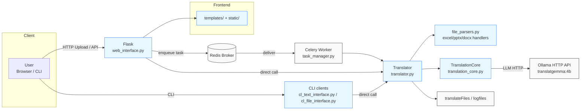

# 项目架构图

下面是项目的 Mermaid 架构图源文件（可在支持 Mermaid 的渲染器中查看）：

```mermaid
flowchart LR
  subgraph Client
    U[User<br/>Browser / CLI]
  end

  U -->|HTTP Upload / API| Web[Flask<br/>web_interface.py]
  U -->|CLI| CLI[CLI clients<br/>cl_text_interface.py / cl_file_interface.py]

  Web -->|enqueue task| Redis[(Redis Broker)]
  Redis -->|deliver| CeleryWorker[Celery Worker<br/>task_manager.py]

  CeleryWorker --> Translator[Translator<br/>translator.py]
  Web -->|direct call| Translator
  CLI -->|direct call| Translator

  Translator --> FileParsers[file_parsers.py<br/>excel/pptx/docx handlers]
  Translator --> TranslationCore[TranslationCore<br/>translation_core.py]
  Translator --> Storage[translateFiles / logfiles]

  TranslationCore -->|LLM HTTP| Ollama[Ollama HTTP API<br/>translatgemma:4b]

  subgraph Frontend
    Templates[templates/ + static/]
  end
  Web --> Templates

  classDef infra fill:#f8f9fa,stroke:#333,stroke-width:1px;
  classDef app fill:#e6f7ff,stroke:#2b7cff,stroke-width:1px;
  class Web,Templates,Translator,TranslationCore,FileParsers,CLI,Redis,CeleryWorker,Ollama,Storage app;
  class Redis,CeleryWorker,Ollama,Storage infra;
```

- 文件位置：`ARCHITECTURE_DIAGRAM.md`
- 说明：该图展示用户请求流、任务队列（Redis + Celery）、翻译调度与 `TranslationCore` 到本地 Ollama 的调用关系。